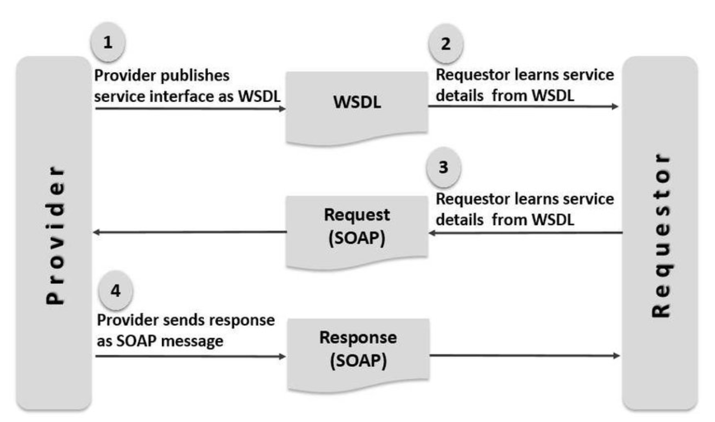
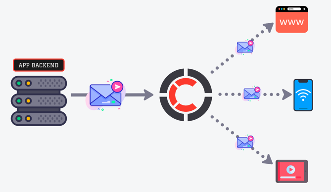
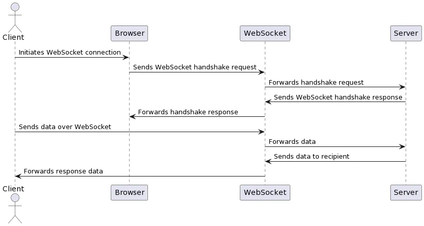
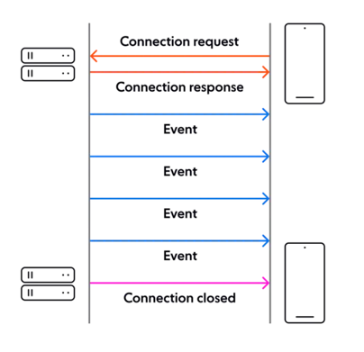
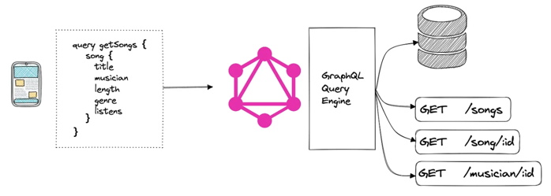
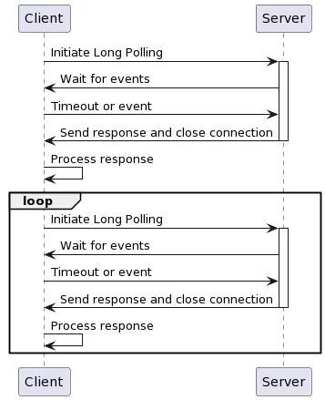
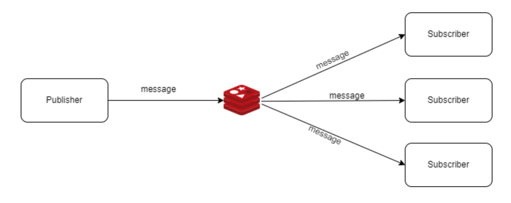
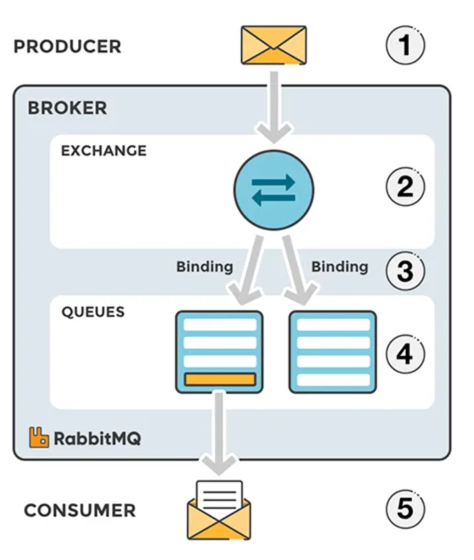
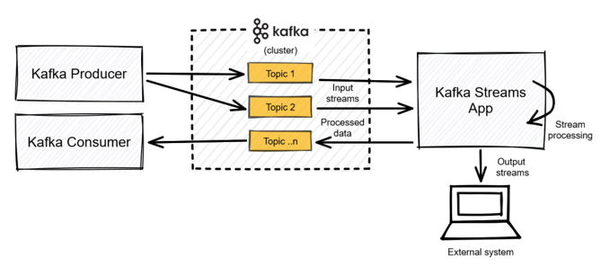

# сlient-server interaction way

# Routes

| Route                    | Description     |
|--------------------------|-----------------|
| /soap                    | SOAP server     |
| /graphql                 | Graphql server  |
| /soap/push/{count}       | Push N messages |
| /mercure/push/{count}    | Push N messages |
| /centrifugo/push/{count} | Push N messages |
| /pusher/push/{count}     | Push N messages |
| /graphql/push/{count}    | Push N messages |
| /sse/push/{count}        | Push N messages |
| /long-pull/push/{count}  | Push N messages |
| /websocket/push/{count}  | Push N messages |
| /rabbitmq/push/{count}   | Push N messages |
| /kafka/push/{count}      | Push N messages |
| /redis/push/{count}      | Push N messages |

# Console commands

| Command                | Description         |
|------------------------|---------------------|
| app:websocket:start    | websocket server    |
| app:rabbitmq:subscribe | rabbitmq subscriber |
| app:kafka:subscribe    | kafka subscriber    |
| app:redis:subscribe    | redis subscriber    |

## <h1>SOAP</h1>

### Description

SOAP (Simple Object Access Protocol) is a protocol used for exchanging structured information in web services. It uses XML for its message format and typically relies on HTTP or SMTP for message negotiation and transmission.

## <h1>Mercure (SSE)</h1>

### Description

Mercure is a protocol allowing to push data updates to web browsers and other HTTP clients in a convenient, fast, reliable and battery-efficient way. It is especially useful to publish real-time updates of resources served through web APIs, to reactive web and mobile apps.

### Sources
* Component: https://github.com/dunglas/mercure
* Protokol: https://github.com/dunglas/mercure/blob/master/spec/mercure.md
* Website: https://mercure.rocks
* Demo: https://demo.mercure.rocks/

## <h1>Centrifugo (WebSocket)</h1>

### Description

Centrifugo - is a real-time messaging server and its friends. Centrifugal organization provides a set of tools to add real-time features to your web/mobile/desktop application. It brings together several repositories linked by a common purpose – give you a complete and ready to use solution when you want to add real-time events into your application.

### Sources
* Component: https://github.com/centrifugal/centrifugo
* Documentation v1: https://centrifugal.github.io/centrifugo/
* Documentation v2: https://github.com/oleh-ozimok/php-centrifugo
* Demo: https://centrifugo.herokuapp.com/#/ && https://centrifugo2.herokuapp.com/

## <h1>Pusher</h1>

### Description

Easily build scalable realtime graphs, geotracking, multiplayer games, and more in your web and mobile apps with our hosted pub/sub messaging API.

### Sources
* Website: www.pusher.com
* Component: https://github.com/pusher/pusher-http-php
* Documentation: https://pusher.com/docs

## <h1>Websocket</h1>

### Description

WebSocket is a communication protocol that provides full-duplex communication channels over a single, long-lived TCP connection. Unlike traditional HTTP, which follows a request-response model, WebSocket allows for persistent connections, enabling real-time data exchange between the client and server.

## <h1>SSE</h1>

### Description

Server-Sent Events (SSE) is a technology that allows a server to send real-time updates to the client over HTTP. Unlike WebSockets, SSE is a one-way communication channel from the server to the browser, and it is simpler to implement for use cases like live feeds, notifications, or streaming updates.

## <h1>GraphQL</h1>

### Description

GraphQL is a query language for APIs and a runtime for executing those queries by using a type system you define for your data. Developed by Facebook in 2012 and open-sourced in 2015, it offers a more flexible and efficient alternative to REST.

## <h1>Long Polling + Data Storage</h1>

### Description

Long Polling is a technique where the client sends a request to the server and waits for a response. The server holds the request open until it has new data to send back or until a timeout occurs. Long Polling is a low-overhead approach suitable for projects with a low volume of clients and a low frequency of updates.

## <h1>Redis Pub/Sub</h1>

### Description

Redis Pub/Sub is a messaging pattern provided by Redis, allowing message exchange between producers and consumers in a decoupled way. It is used for real-time messaging systems, notifications, and broadcasting updates to multiple subscribers.

## <h1>RabbitMQ (STOMP)</h1>

### Description

RabbitMQ is an open-source message-broker software (sometimes called message-oriented middleware) that originally implemented the Advanced Message Queuing Protocol (AMQP) and has since been extended with a plug-in architecture to support Streaming Text Oriented Messaging Protocol (STOMP), Message Queuing Telemetry Transport (MQTT), and other protocols.

### Sources
* Website: https://www.rabbitmq.com/
* Component: https://github.com/php-amqplib/php-amqplib
* Documentation: https://www.rabbitmq.com/documentation.html

## <h1>Kafka</h1>

### Description

Kafka, officially known as Apache Kafka, is an open-source distributed event streaming platform. Originally developed by LinkedIn and later donated to the Apache Software Foundation, Kafka is designed to handle real-time data feeds. It is used for building real-time data pipelines and streaming applications.

## <h1>JWT</h1>

JSON Web Token (JWT) is an open standard (RFC 7519) that defines a compact and self-contained way for securely transmitting information between parties as a JSON object. Although JWTs can be encrypted to also provide secrecy between parties, we will focus on signed tokens.

### Sources
* Website: https://jwt.io/
* Documentation: https://jwt.io/introduction/

## Author
[Dykyi Roman](https://www.linkedin.com/in/roman-dykyi-43428543/), e-mail: [mr.dukuy@gmail.com](mailto:mr.dukuy@gmail.com)
